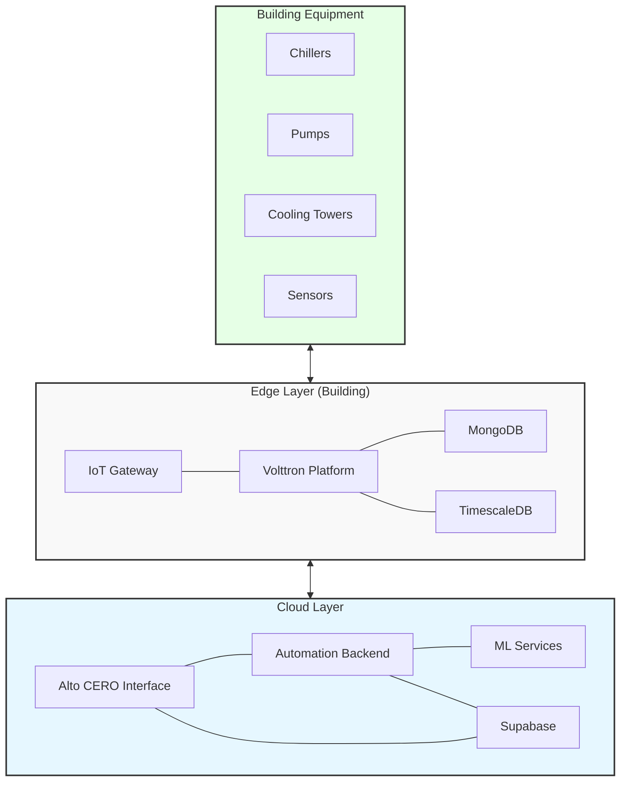

# Architecture Overview

Alto CERO 2.0 is built on a modern, scalable architecture that combines edge computing, cloud services, and advanced analytics to provide a comprehensive building management solution.

## System Architecture

<Frame>
  
</Frame>

The architecture consists of several layers:

### Edge Layer

The edge layer operates within the building premises and is responsible for direct interaction with building equipment.

<CardGroup cols={2}>
  <Card title="IoT Gateway" icon="microchip">
    Physical device running Alto OS that connects to building equipment via BACnet and other protocols.
  </Card>
  <Card title="Volttron Platform" icon="network-wired">
    Open-source platform for distributed control that hosts various agents for data collection, validation, and control.
  </Card>
  <Card title="Local Databases" icon="database">
    Local data storage for real-time and historical data, including MongoDB and TimescaleDB.
  </Card>
  <Card title="Edge Analytics" icon="chart-line">
    On-premises analytics for real-time decision making and control.
  </Card>
</CardGroup>

### Cloud Layer

The cloud layer provides centralized management, analytics, and user interfaces.

<CardGroup cols={2}>
  <Card title="Alto CERO Interface" icon="display">
    Web-based user interface for monitoring and control.
  </Card>
  <Card title="Automation Backend" icon="gears">
    API services and business logic for automation and control.
  </Card>
  <Card title="ML Services" icon="brain">
    Machine learning services for predictive analytics and optimization.
  </Card>
  <Card title="Supabase" icon="database">
    Authentication, authorization, and data storage for user and configuration data.
  </Card>
</CardGroup>

## Component Relationships

## Core Components

### Alto OS

Alto OS is the operating system that runs on the IoT Gateway. It provides:

- Secure boot and operation
- Service management
- Remote management capabilities
- Automatic updates
- Container orchestration

### Volttron Agents

Volttron hosts several agents that perform specific functions:

| Agent Type | Description |
|------------|-------------|
| BACnet Driver | Communicates with BACnet devices |
| Historian | Collects and stores historical data |
| Master Driver | Manages device drivers |
| Weather | Retrieves weather data |
| Optimizer | Runs optimization algorithms |
| Fault Detection | Detects equipment faults |
| Analytics | Performs analytics on collected data |

### Databases

Alto CERO 2.0 uses multiple databases for different purposes:

<Tabs>
  <Tab title="MongoDB">
    **Purpose**: Real-time state data
    
    **Data Types**:
    - Current equipment status
    - Active alarms
    - User sessions
    - Operational parameters
  </Tab>
  <Tab title="TimescaleDB">
    **Purpose**: Time-series historical data
    
    **Data Types**:
    - Sensor readings
    - Equipment performance metrics
    - Energy consumption
    - Control actions
  </Tab>
  <Tab title="Supabase (PostgreSQL)">
    **Purpose**: User and configuration data
    
    **Data Types**:
    - User accounts and permissions
    - Site configurations
    - Equipment configurations
    - Audit logs
  </Tab>
</Tabs>

### Web Interface

The Alto CERO Interface is a React-based web application that provides:

- Real-time monitoring dashboards
- Equipment control interfaces
- Historical trend analysis
- Alarm management
- Configuration tools
- Reporting and analytics

## Deployment Models

Alto CERO 2.0 supports multiple deployment models:

<AccordionGroup>
  <Accordion title="On-premises">
    All components run within the customer's network. Cloud connectivity is optional for remote access.
  </Accordion>
  <Accordion title="Hybrid">
    Edge components run on-premises, while management and analytics run in the cloud. This is the most common deployment model.
  </Accordion>
  <Accordion title="Multi-site">
    Multiple buildings are connected to a central cloud instance, enabling portfolio-wide management and analytics.
  </Accordion>
  <Accordion title="Fully Managed">
    All components are managed by AltoTech, providing a complete service solution.
  </Accordion>
</AccordionGroup>

## Communication Protocols

Alto CERO 2.0 uses several communication protocols:

- **BACnet/IP**: Primary protocol for building equipment communication
- **MQTT**: Internal message bus communication
- **HTTPS/REST**: API communication between components
- **WebSocket**: Real-time data updates to the user interface
- **AMQP**: Message queuing for asynchronous processing

## Security Architecture

<Frame>
  
</Frame>

Security is implemented at multiple levels:

1. **Network Security**: VPN, firewalls, network segmentation
2. **Device Security**: Secure boot, encrypted storage, signed updates
3. **Application Security**: Authentication, authorization, input validation
4. **Data Security**: Encryption at rest and in transit
5. **User Security**: Role-based access control, multi-factor authentication

For more details, see the [Security Architecture](/architecture/security) documentation. 