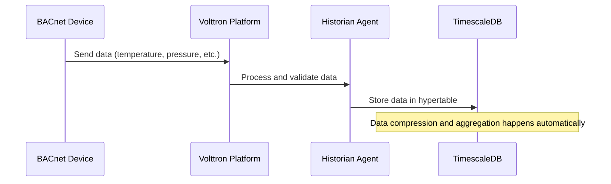

# TimescaleDB

TimescaleDB is a time-series database built on PostgreSQL that provides the historical data storage capabilities for Alto CERO 2.0. It efficiently stores and queries time-series data from building equipment, enabling historical analysis, trend identification, and reporting.

## Overview

<Frame>
  
</Frame>

TimescaleDB is used to store:
- Sensor readings (temperature, pressure, flow rates)
- Equipment performance metrics (power consumption, efficiency)
- System status changes
- Control actions
- Calculated KPIs (kW/RT, energy savings)

## Database Structure

TimescaleDB organizes data in **hypertables**, which are PostgreSQL tables optimized for time-series data. The primary hypertable structure in Alto CERO 2.0 is:

```sql
CREATE TABLE equipment_data (
  time TIMESTAMPTZ NOT NULL,
  site_id TEXT,
  equipment_id TEXT,
  point_name TEXT,
  value DOUBLE PRECISION,
  quality INTEGER,
  PRIMARY KEY (time, site_id, equipment_id, point_name)
);

SELECT create_hypertable('equipment_data', 'time');
```

### Data Retention

TimescaleDB supports data retention policies to manage the growth of historical data:

```sql
-- Retain raw data for 90 days, then aggregate to hourly samples
SELECT add_retention_policy('equipment_data', INTERVAL '90 days');

-- Create continuous aggregates for longer-term storage
CREATE MATERIALIZED VIEW equipment_data_hourly
WITH (timescaledb.continuous) AS
SELECT
  time_bucket('1 hour', time) AS bucket,
  site_id,
  equipment_id,
  point_name,
  AVG(value) AS avg_value,
  MIN(value) AS min_value,
  MAX(value) AS max_value,
  COUNT(*) AS sample_count
FROM equipment_data
GROUP BY bucket, site_id, equipment_id, point_name;
```

## Data Model

The data model in TimescaleDB follows the schema defined in the `model_schema.yaml` file, which specifies how different types of equipment data should be processed and stored.

<Accordion title="Example Schema for Chiller Data">
```yaml
chiller:
  status_read: [ last ]
  status_write: [ last ]
  status_local: [ last ]
  mode: [ last ]
  power: [ mean ]
  cumulative_energy: [ last ]
  efficiency: [ last ]
  efficiency_ref: [ last ]
  alarm: [ last ]
  maintenance: [ last ]
  running_capacity: [ mean ]
  running_capacity_percentage: [ mean ]
  percentage_rla: [ mean ]
  # ... other fields
```
</Accordion>

The schema defines aggregation methods for each data point:
- `mean`: Calculate average value over the aggregation period
- `last`: Use the most recent value in the aggregation period
- `min`, `max`: Find minimum/maximum values in the period
- `sum`: Sum all values in the period

## Integration with Volttron

TimescaleDB integrates with Volttron through the Historian agent, which collects data from building equipment and stores it in the database.



## Configuration

TimescaleDB is configured in the docker-compose.yml file:

```yaml
timescaledb:
  image: timescale/timescaledb-ha:pg17
  container_name: infra_timescaledb
  restart: unless-stopped
  ports:
    - 5433:5432
  volumes:
    - timescaledb_data:/home/postgres/pgdata/data
    - ./scripts/databases:/timescaledb
  env_file:
    - .env
  environment:
    - POSTGRES_DB=${TIMESCALEDB_DATABASE}
    - POSTGRES_PASSWORD=${TIMESCALEDB_PASSWORD}
  command: 
    - "bash"
    - "-c"
    - "/timescaledb/timescaledb-entrypoint.sh"
```

The corresponding environment variables are set in the `.env` file:

```bash
TIMESCALEDB_PASSWORD=your_secure_password
TIMESCALEDB_DATABASE=postgres
TIMESCALEDB_HOST=infra_timescaledb
TIMESCALEDB_PORT=5432
TIMESCALEDB_USER=postgres
```

## Performance Optimization

TimescaleDB in Alto CERO 2.0 is optimized for:

<CardGroup cols={2}>
  <Card title="Query Performance" icon="bolt">
    Indexes on time, site_id, and equipment_id columns accelerate common queries
  </Card>
  <Card title="Data Compression" icon="compress">
    Native TimescaleDB compression reduces storage requirements by up to 90%
  </Card>
  <Card title="Retention Policies" icon="clock">
    Automated data retention policies manage database growth
  </Card>
  <Card title="Continuous Aggregates" icon="chart-line">
    Pre-computed aggregates speed up dashboard and reporting queries
  </Card>
</CardGroup>

## Backup and Recovery

TimescaleDB data is backed up regularly to ensure data durability:

```bash
# Example backup command from the scripts directory
pg_dump -h infra_timescaledb -U postgres -F c -b -v -f "/backup/timescaledb_backup_$(date +%Y%m%d_%H%M%S).dump" postgres
```

Backups can be:
- Stored locally
- Uploaded to cloud storage
- Encrypted for additional security

## Query Examples

<Tabs>
  <Tab title="Simple Query">
    ```sql
    -- Get the last 24 hours of chiller efficiency data
    SELECT time_bucket('15 minutes', time) AS period,
           AVG(value) AS efficiency
    FROM equipment_data
    WHERE site_id = 'site1'
      AND equipment_id = 'chiller1'
      AND point_name = 'efficiency'
      AND time > NOW() - INTERVAL '24 hours'
    GROUP BY period
    ORDER BY period;
    ```
  </Tab>
  <Tab title="Comparison Query">
    ```sql
    -- Compare efficiency between two chillers
    SELECT time_bucket('1 hour', e1.time) AS period,
           AVG(e1.value) AS chiller1_efficiency,
           AVG(e2.value) AS chiller2_efficiency
    FROM equipment_data e1
    JOIN equipment_data e2 ON
      time_bucket('1 hour', e1.time) = time_bucket('1 hour', e2.time)
    WHERE e1.site_id = 'site1' AND e1.equipment_id = 'chiller1' AND e1.point_name = 'efficiency'
      AND e2.site_id = 'site1' AND e2.equipment_id = 'chiller2' AND e2.point_name = 'efficiency'
      AND e1.time > NOW() - INTERVAL '7 days'
    GROUP BY period
    ORDER BY period;
    ```
  </Tab>
  <Tab title="Advanced Query">
    ```sql
    -- Calculate daily energy usage and efficiency
    SELECT 
      time_bucket('1 day', time) AS day,
      SUM(CASE WHEN point_name = 'power' THEN value ELSE 0 END) AS total_power_consumption,
      AVG(CASE WHEN point_name = 'efficiency' THEN value ELSE NULL END) AS avg_efficiency,
      MAX(CASE WHEN point_name = 'cooling_rate' THEN value ELSE 0 END) AS peak_cooling_rate
    FROM equipment_data
    WHERE site_id = 'site1'
      AND equipment_id = 'chiller1'
      AND time > NOW() - INTERVAL '30 days'
      AND point_name IN ('power', 'efficiency', 'cooling_rate')
    GROUP BY day
    ORDER BY day;
    ```
  </Tab>
</Tabs>

## Troubleshooting

Common issues and solutions:

<AccordionGroup>
  <Accordion title="Connection Issues">
    - Verify the container is running: `docker ps | grep timescaledb`
    - Check logs: `docker logs infra_timescaledb`
    - Ensure credentials match in .env file
    - Verify network connectivity: `telnet infra_timescaledb 5432`
  </Accordion>
  <Accordion title="Performance Problems">
    - Monitor slow queries: Enable `log_min_duration_statement` setting
    - Check for missing indexes on commonly queried columns
    - Ensure continuous aggregates are correctly configured
    - Verify sufficient resources (memory, CPU, disk I/O)
  </Accordion>
  <Accordion title="Space Issues">
    - Check current database size: `SELECT pg_size_pretty(pg_database_size('postgres'))`
    - Verify retention policies are working: `SELECT * FROM timescaledb_information.policy;`
    - Adjust compression settings if needed
    - Consider adding storage to the volume
  </Accordion>
</AccordionGroup>

## Best Practices

1. **Query Optimization**: Use time buckets and prepared statements for efficient queries
2. **Index Management**: Create indexes only on frequently queried columns
3. **Partitioning Strategy**: Configure chunk intervals based on query patterns and data volume
4. **Monitoring**: Set up monitoring for database size, query performance, and backup status
5. **Regular Maintenance**: Schedule vacuum and analyze operations during low-usage periods 