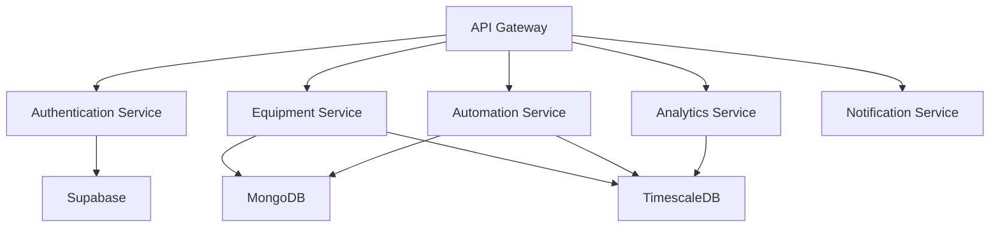

# Components Overview

Alto CERO 2.0 is composed of several interconnected components that work together to provide a comprehensive building management solution. This page provides an overview of these components and their relationships.

## Core Components

<CardGroup cols={3}>
  <Card title="Databases" icon="database" href="/components/databases/mongodb">
    Storage solutions for real-time, historical, and user data.
  </Card>
  <Card title="Volttron Platform" icon="network-wired" href="/components/volttron/platform-overview">
    Open-source platform for distributed sensing and control.
  </Card>
  <Card title="Frontend Interfaces" icon="display" href="/components/frontend/alto-cero-interface">
    User interfaces for monitoring and control.
  </Card>
  <Card title="Backend Services" icon="server" href="/components/backend/automation-backend">
    API services and business logic.
  </Card>
  <Card title="AI Services" icon="brain" href="/components/ai-services/prediction-service">
    Machine learning and predictive analytics.
  </Card>
  <Card title="IoT Gateway" icon="microchip">
    Physical gateway for connecting to building equipment.
  </Card>
</CardGroup>

## Component Architecture

<Frame>
  
</Frame>

The diagram above illustrates how the components interact with each other. Key interactions include:

- **IoT Gateway** connects to building equipment via BACnet and other protocols
- **Volttron Platform** hosts agents that collect data and control equipment
- **Databases** store different types of data (MongoDB for real-time, TimescaleDB for historical)
- **Backend Services** provide business logic and API endpoints
- **Frontend Interfaces** provide user interfaces for monitoring and control
- **AI Services** provide predictive analytics and optimization

## Database Components

<CardGroup cols={3}>
  <Card title="MongoDB" icon="database" href="/components/databases/mongodb">
    Document database for real-time state data and configuration
  </Card>
  <Card title="TimescaleDB" icon="clock" href="/components/databases/timescaledb">
    Time-series database for historical data and trends
  </Card>
  <Card title="Supabase" icon="user" href="/components/databases/supabase">
    PostgreSQL database with real-time capabilities for user management and authentication
  </Card>
</CardGroup>

MongoDB stores the current state of the system, including equipment status, current readings, and active alarms. TimescaleDB stores historical data for trend analysis and reporting. Supabase provides user management, authentication, and authorization.

## Volttron Components

The Volttron platform hosts several agents that perform specific functions:

<AccordionGroup>
  <Accordion title="BACnet Driver">
    Communicates with BACnet devices in the building.
  </Accordion>
  <Accordion title="Master Driver">
    Manages device drivers and schedules periodic data collection.
  </Accordion>
  <Accordion title="Historian">
    Collects and stores historical data in TimescaleDB.
  </Accordion>
  <Accordion title="Weather">
    Retrieves weather data for environmental context.
  </Accordion>
  <Accordion title="Optimizer">
    Runs optimization algorithms to maximize efficiency.
  </Accordion>
  <Accordion title="Fault Detection">
    Detects equipment faults and anomalies.
  </Accordion>
</AccordionGroup>

For more details, see the [Volttron Platform Overview](/components/volttron/platform-overview) and [Volttron Agents](/components/volttron/agents) documentation.

## Frontend Components

<Tabs>
  <Tab title="Alto CERO Interface">
    The main user interface for Alto CERO 2.0, built with React and Material-UI. It provides dashboards, equipment controls, alarm management, and configuration tools.
    
    <Frame>
      
    </Frame>
    
    [Learn more](/components/frontend/alto-cero-interface)
  </Tab>
  <Tab title="Alto Dash">
    An analytics dashboard for visualizing historical data and performance metrics. Built with React and D3.js.
    
    <Frame>
      
    </Frame>
    
    [Learn more](/components/frontend/alto-dash)
  </Tab>
</Tabs>

## Backend Components

The backend services provide REST APIs and business logic for the frontend interfaces.

For more details, see the [Automation Backend](/components/backend/automation-backend) and [API Services](/components/backend/api-services) documentation.

## AI/ML Components

<CardGroup cols={2}>
  <Card title="Prediction Service" icon="chart-line" href="/components/ai-services/prediction-service">
    Predicts equipment performance and energy consumption
  </Card>
  <Card title="MLflow" icon="vial" href="/components/ai-services/mlflow">
    Tracks experiments and manages model lifecycle
  </Card>
</CardGroup>

The AI services provide predictive analytics and optimization capabilities. The Prediction Service forecasts equipment performance and energy consumption, while MLflow tracks experiments and manages model lifecycle.

## Data Flow Between Components

Data flows through the system in several ways:

<Steps>
  <Step title="Data Collection">
    1. BACnet Driver collects data from building equipment
    2. Master Driver schedules and coordinates data collection
    3. Raw data is validated and normalized
  </Step>
  <Step title="Data Storage">
    1. Current state data is stored in MongoDB
    2. Historical data is stored in TimescaleDB
    3. User and authentication data is stored in Supabase
  </Step>
  <Step title="Data Processing">
    1. Analytics Service processes historical data for trends and insights
    2. Prediction Service generates forecasts and recommendations
    3. Automation Service applies control strategies
  </Step>
  <Step title="Data Presentation">
    1. Alto CERO Interface displays real-time dashboards and controls
    2. Alto Dash provides in-depth analytics and visualizations
    3. Reports and notifications deliver insights to users
  </Step>
</Steps>

## Component Dependencies

Each component has dependencies on other components. The table below shows the key dependencies:

| Component | Depends On |
|-----------|------------|
| Alto CERO Interface | Automation Backend, Supabase |
| Automation Backend | MongoDB, TimescaleDB, Volttron Platform |
| Volttron Platform | BACnet Driver, MongoDB, TimescaleDB |
| AI Services | TimescaleDB, MongoDB |
| Alto Dash | TimescaleDB, MongoDB |

## Deployment Considerations

When deploying Alto CERO 2.0, consider the following:

<Warning>
  All components must be able to communicate with each other over the network. Ensure that firewalls allow the necessary traffic.
</Warning>

<Note>
  Some components can be deployed in high-availability configurations for increased reliability. See the [Installation Guide](/installation/environment-setup) for details.
</Note>

- **Edge Components**: IoT Gateway, Volttron Platform, MongoDB, TimescaleDB
- **Cloud Components**: Alto CERO Interface, Automation Backend, AI Services, Supabase (optional)
- **Hybrid Deployment**: Edge components on-premises, cloud components in the cloud

For more details on each component, refer to the specific component documentation pages linked throughout this overview. 