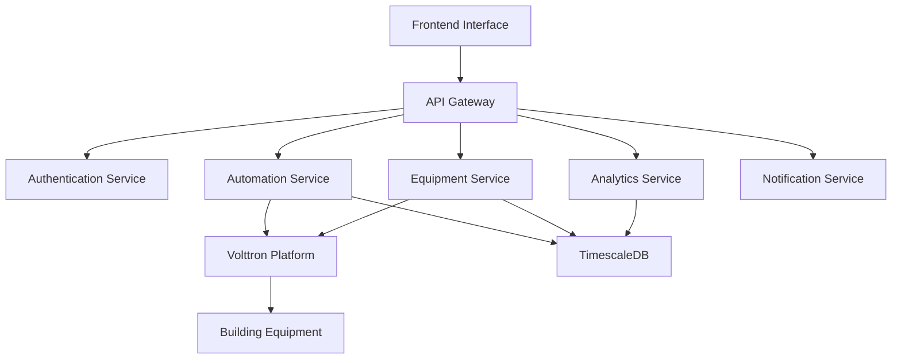

# Key Concepts

This guide introduces the core concepts and terminology used throughout the Alto CERO 2.0 platform.

## System Components

### Chiller Plant Management System (CPMS)

The Chiller Plant Management System (CPMS) is the central component of Alto CERO 2.0, responsible for monitoring, controlling, and optimizing the performance of chiller plants and HVAC systems in buildings.

<Frame>
  
</Frame>

### Building Equipment

Alto CERO 2.0 integrates with various types of building equipment:

<AccordionGroup>
  <Accordion title="Chillers">
    The primary cooling equipment that removes heat from a liquid via a vapor-compression or absorption refrigeration cycle.
  </Accordion>
  <Accordion title="Pumps">
    - **Primary Chilled Water Pumps (PCHP)**: Circulate water through the chiller evaporator
    - **Secondary Chilled Water Pumps (SCHP)**: Distribute chilled water to air handling units
    - **Condenser Water Pumps (CDP)**: Circulate water between chillers and cooling towers
  </Accordion>
  <Accordion title="Cooling Towers (CT)">
    Heat rejection devices that reject waste heat to the atmosphere through the cooling of water.
  </Accordion>
  <Accordion title="Sensors">
    Devices that measure temperature, pressure, flow, power consumption, and other parameters.
  </Accordion>
</AccordionGroup>

## Core Technologies

### Volttron Platform

Volttron is an open-source platform for distributed sensing and control. It serves as the foundation for Alto CERO 2.0's agent-based architecture, enabling:

- Distributed computing
- Message-based communication
- Secure data exchange
- Device integration
- Agent management

### BACnet Protocol

Building Automation and Control networks (BACnet) is the primary communication protocol used by Alto CERO 2.0 to integrate with building equipment. It enables standardized communication between different devices from various manufacturers.

### Microservices Architecture

Alto CERO 2.0 uses a microservices architecture, with separate services for different functionalities:

## Data Flow

<Tabs>
  <Tab title="Data Collection">
    1. Building equipment data is collected via BACnet
    2. Volttron agents process and validate the data
    3. Data is stored in both MongoDB (current state) and TimescaleDB (historical data)
  </Tab>
  <Tab title="Control Flow">
    1. Control decisions are made by optimization algorithms or operator input
    2. Commands are sent to Volttron control agents
    3. Agents translate commands to BACnet write operations
    4. Building equipment executes the commands
  </Tab>
  <Tab title="Analytics Flow">
    1. Historical data is retrieved from TimescaleDB
    2. Data is processed by analytics services
    3. Insights and recommendations are generated
    4. Results are displayed in the user interface or used for automated control
  </Tab>
</Tabs>

## Key Performance Indicators (KPIs)

Alto CERO 2.0 tracks several important KPIs:

- **System Efficiency**: Measured in kW/RT (kilowatts per refrigeration ton)
- **Energy Consumption**: Total power consumption over time
- **Plant Load**: Current cooling load as a percentage of capacity
- **Equipment Runtime**: Operating hours of each piece of equipment
- **Energy Savings**: Comparison with baseline performance

## User Roles and Permissions

<CardGroup cols={3}>
  <Card title="Operators" icon="user-gear">
    Day-to-day operation of the system, acknowledging alarms, adjusting setpoints
  </Card>
  <Card title="Engineers" icon="screwdriver-wrench">
    System tuning, configuration changes, optimization strategy setup
  </Card>
  <Card title="Managers" icon="user-tie">
    Access to reports, KPIs, and high-level system performance metrics
  </Card>
</CardGroup>

## Operational Modes

Alto CERO 2.0 supports multiple operational modes:

- **Manual Mode**: Direct operator control of equipment
- **Auto Mode**: System follows predefined schedules and setpoints
- **Optimization Mode**: AI-driven control for maximum efficiency
- **Maintenance Mode**: Safe operation during maintenance activities

## Glossary

<ResponseField name="BACnet">
  Building Automation and Control networks - A data communication protocol for building automation and control systems.
</ResponseField>

<ResponseField name="CPMS">
  Chiller Plant Management System - System for monitoring and controlling chiller plant operations.
</ResponseField>

<ResponseField name="IoT Gateway">
  Internet of Things Gateway - Hardware device that collects data from building equipment and sends it to the cloud.
</ResponseField>

<ResponseField name="RT">
  Refrigeration Ton - Unit of cooling capacity (1 RT = 3.517 kW).
</ResponseField>

<ResponseField name="kW/RT">
  Kilowatts per Refrigeration Ton - Measure of chiller efficiency (lower is better).
</ResponseField>

<ResponseField name="BTU">
  British Thermal Unit - Traditional unit of heat energy.
</ResponseField>

<ResponseField name="PUE">
  Power Usage Effectiveness - Ratio of total facility energy to IT equipment energy (for data centers).
</ResponseField> 